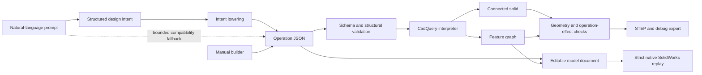

# Architecture

Prompt2ParametricCAD uses a staged pipeline so language understanding, CAD
representation, solid modeling, and evaluation can improve independently.

## Production pipeline

The operation JSON is the central contract. Prompt generation and the manual
builder both produce it; validation, building, evaluation, and exports consume
it.

## Core modules

| Module | Responsibility |
| --- | --- |
| `design_intent.py` | Relationship-aware description of the requested part |
| `prompting.py` | Structured OpenAI calls, examples, and bounded repair |
| `intent_alignment.py` | Normalizes intent vocabulary before lowering |
| `intent_coverage.py` | Detects concepts or dimensions lost in translation |
| `schema.py` | Strict operation JSON contract |
| `interpreter.py` | Ordered CadQuery construction and reference registration |
| `feature_graph.py` | Feature dependencies, references, and build order |
| `feature_registry.py` | Runtime face, edge, alias, and target lookup |
| `sketch_model.py` | Normalized sketch entities and geometric metadata |
| `editable_model.py` | Versioned features, named parameters, source paths, and transactional rebuilds |
| `solidworks_replay.py` | Validates and lowers the supported editable subset into a deterministic native replay plan |
| `solidworks_editability.py` | Classifies named, relation-controlled, and unsupported native parameter controls |
| `solidworks_verification.py` | Compares CadQuery/SolidWorks geometry and verifies persistent semantic references |
| `solidworks_replay_runner.cs` | Replays native sketches, dimensions, dependencies, boss/cut features, and `SLDPRT` output through the installed SolidWorks API |
| `capability_audit.py` | Generates profile/operation composition cases and verifies schema, STEP, repair, and optional native SolidWorks parity |
| `release_matrix.py` | Runs reviewed prompt/intent pairs through lowering, STEP round-trip, editable mutation, replay planning, and optional native SLDPRT create/edit/reopen verification |
| `quality.py` | Schema, structure, build, export, and geometry quality gates |
| `operation_effects.py` | Verifies each feature materially changed geometry |
| `web_app.py` | FastAPI endpoints and production frontend hosting |

## Design intent

Design intent is a higher-level representation than raw CAD commands. It stores
what a feature means—centered boss, near-corner holes, bolt-circle pattern,
offset slot—before deciding exact operation coordinates.

The lowering stage:

1. validates required concepts and dimensions;
2. aligns aliases and general relationship vocabulary;
3. resolves parents and target faces;
4. computes positions from host geometry;
5. emits strict operation JSON;
6. checks that required intent survived lowering.

This representation is also the preferred format for future training data
because it isolates language reasoning from CadQuery syntax.

## Geometry and references

The interpreter builds operations sequentially. Each feature receives:

- a stable feature ID;
- a build-order index;
- parent and child relationships;
- a normalized sketch;
- named driving parameters linked to exact operation source paths;
- created face and edge references;
- readable aliases such as `feature_1.top`;
- geometry summaries used by evaluators.

Canonical IDs such as `base.face.f001` are intended to remain machine-friendly.
Aliases remain prompt- and UI-friendly. Target resolution uses geometry-derived
frames and directional aliases when possible, rather than fixed global planes.

## Quality pipeline

A successful build must pass multiple independent layers:

1. JSON Schema validation
2. operation ordering and target validation
3. design-intent coverage checks
4. progressive CadQuery build
5. connected-solid and shape-validity checks
6. operation-effect checks
7. semantic/eval-case assertions
8. STEP export verification

Failures are structured by operation and stage so they can drive UI feedback,
benchmarks, or bounded repair attempts.

## Frontend and API

The supported frontend is the React/Vite app in `frontend/`. In development,
Vite proxies `/api` to FastAPI. For a production-style local run, Vite builds to
`frontend/dist` and FastAPI serves the compiled application and CAD endpoints
from one origin.

The public workflow uses `/generate` for automatic prompt generation and
`/build` for supplied operation JSON. Manual-builder assistance uses
`/suggest-base` and `/suggest-feature`. `/editable-model` returns the named
feature parameters for a validated model, while `/edit-parameters` applies
transactional updates and exports only a successful rebuild.

## Current constraints

- STEP preserves final geometry, not a native editable feature history; the
  optional SolidWorks adapter separately replays all current operation
  categories as native features, subject to installed-version smoke testing.
- Topological names can change after cuts, fillets, chamfers, and shelling.
- Direct child sketches require published planar faces; arbitrary curved-surface sketch supports remain outside the release contract.
- Some compound CAD concepts still lower into multiple primitive operations.
- Semantic correctness is harder to prove than geometric validity.

The feature graph, normalized sketches, reference registry, and versioned
editable-model document are the CAD-neutral intermediate layer used by the
first SolidWorks replay adapter and future native-CAD adapters. See
[editable_features.md](editable_features.md) for the implemented replay slice,
current representation gaps, and safeguards against topology changes.
