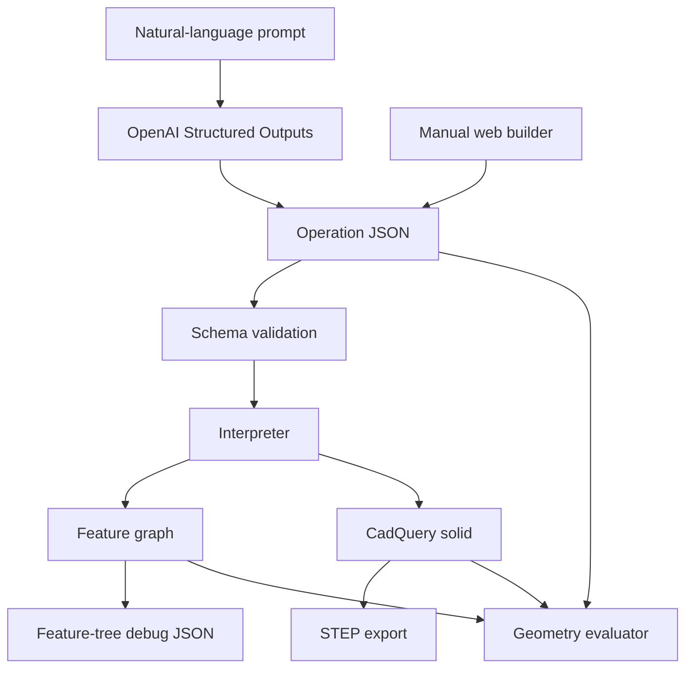

# Prompt2ParametricCAD architecture

Prompt2ParametricCAD is organized around one central idea: every generated part
should be represented as an ordered feature sequence before it becomes CAD
geometry. The JSON operation list is the contract between user input, AI output,
validation, CadQuery model construction, debug export, and future editable CAD
export.

## System pipeline

## Main components

### Schema

`src/prompt2cad/schema.py` defines the allowed CAD operation JSON structure. It
is intentionally strict because downstream geometry construction depends on
predictable fields.

The schema currently covers:

- base extrusions
- base revolves
- additive extrudes
- cutting extrudes
- additive revolves
- cutting revolves
- rectangle, circle, polygon, polyline, and sketch profiles
- sketch segments with lines and arcs
- repeated feature positions

### Prompting

`src/prompt2cad/prompting.py` converts natural-language requests into schema
valid model data. The current approach uses OpenAI Structured Outputs so the
model returns JSON directly instead of freeform text.

The prompt layer should stay responsible for intent translation, not geometry
repair. If a generated model is invalid, the preferred long-term fix is usually
better operation representation or validation, not more hidden prompt hacks.

### Manual builder

The web UI in `src/prompt2cad/web/` provides a guided way to produce operation
JSON without relying only on a sentence. It is useful for demos, debugging, and
for understanding what the language model is supposed to produce.

The manual builder supports:

- base shape selection
- explicit or reasonable dimensions
- added cuts and extrusions
- feature targets
- simple mirror and circular patterns
- API-assisted dimensions/profile generation where needed

### Interpreter

`src/prompt2cad/interpreter.py` is the bridge from operation JSON to CadQuery
geometry. It builds features in order, applies cuts and additions, registers
references, and enforces basic geometry validity.

This is currently the busiest part of the project. As the system grows, good
future split points are:

- sketch construction utilities
- extrude operations
- revolve operations
- reference-frame and face-targeting logic
- validation and repair suggestions

### Feature graph

The feature graph is the foundation for future editability. It records the
semantic build structure alongside the generated geometry.

Important graph data includes:

- feature ids
- operation types
- build order
- parent feature ids
- child feature ids
- target references
- created references
- normalized sketch definitions
- validation warnings

The current reference system separates canonical ids from readable aliases:

- canonical: `base.face.f001`
- alias: `base.top`

This keeps the UI and prompt layer readable while giving the internal system a
more stable naming scheme.

### Evaluator

`src/prompt2cad/evaluator.py` checks generated model data against expected
constraints. It now evaluates more than whether an operation exists.

Supported eval checks include:

- operation count
- base operation fields
- required operations
- repeated operation patterns
- bounding box dimensions
- connected solid count
- solid validity
- approximate volume
- required graph references
- required aliases
- feature parent/child relationships
- sketch profile types

### Fixture-backed evals

Some evals are meant to test AI generation. Others are meant to test the CAD
interpreter, graph, and evaluator deterministically. Fixture-backed evals use
tracked JSON models from `evals/fixtures/` so they can run without API calls.

This gives the project two useful test modes:

1. API evals: ask the model to generate JSON, then evaluate the result.
2. Fixture evals: use known-good JSON to regression-test geometry and graph
   behavior.

## Feature tree direction

The current STEP export produces usable geometry, but STEP does not preserve a
true editable feature tree in the way a native CAD file does. The internal graph
is therefore being shaped toward a future export pipeline.

An editable feature export will eventually need:

- stable feature ids
- build order
- target references
- sketch planes or reference frames
- sketch points, lines, arcs, and circles
- dimensions
- constraints
- operation parameters
- parent/child dependencies
- rebuild validation

The feature-tree debug export is the intermediate contract. Before attempting a
native SolidWorks workflow, the project should first prove that this debug JSON
contains enough information to rebuild the model feature by feature.

## Current risk areas

### Face targeting

Planar rectangular faces are the easiest case. Curved surfaces, polygon sides,
sketch-derived faces, partial revolves, and corner-adjacent geometry are harder
because they require better reference frames and topology tracking.

### Topology changes

A registered face reference can become stale after later cuts. The project does
not yet fully prove that every stored reference still exists after every
operation.

### Pattern representation

The web builder can create repeated positions, mirror-style placement, and
circular placement, but the feature graph does not yet represent these as true
pattern features. That will matter for a future editable CAD export.

### Dependency setup

The project now has pinned dependencies in `requirements.txt`, but CadQuery can
be sensitive to Python and platform versions. A future `environment.yml` may be
useful if Conda becomes the preferred setup path.

## Recommended next milestones

1. Add reference extraction for circular, polygon, and sketch-derived extrusions.
2. Add graph metadata for mirror and circular patterns.
3. Expand evals for curved surfaces, side-face operations, and stale references.
4. Add a graph-only validation path that does not need to build CadQuery solids.
5. Prototype a SolidWorks macro/export adapter from feature-tree debug JSON.
