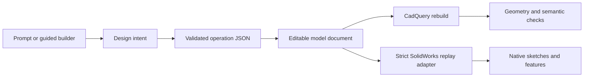

# Editable feature architecture

## Goal

Prompt2ParametricCAD should preserve more than the final STEP solid. A
successful model should also carry enough explicit design information to:

1. show a user named dimensions and feature controls;
2. change one or more values and rebuild the same ordered model;
3. preserve feature IDs, build order, support faces, and parent relationships;
4. replay an explicitly supported subset into a native CAD feature history.

The editable intermediate document remains the source of truth. The first
native SolidWorks `SLDPRT` adapter consumes that document; it does not replace
the CadQuery build or broaden support by silently flattening features.

## Top-down design

The operation JSON remains the execution contract. The editable model document
adds the information a UI or native-CAD adapter needs without changing the
working interpreter:

- a versioned format and explicit units;
- stable feature IDs and build order;
- semantic parents plus the previous feature in model history;
- original and canonical support references;
- normalized sketch entities;
- named driving parameters with exact paths back to operation JSON;
- reference snapshots for later face/edge selection;
- explicit limitations when a feature is not fully parametric yet.

Parameter edits are transactional. They are applied to a copy of the source
operations, validated against the existing schema, and rebuilt through
CadQuery. The previous document remains unchanged if validation or geometry
construction fails.

## Fit with the current system

The existing architecture already provides most of the hard prerequisites:

| Existing layer | Reused for editable features |
| --- | --- |
| Operation JSON | Source of exact dimensions and feature controls |
| Feature graph | IDs, build order, parents, children, and operation snapshots |
| Sketch model | Named points, lines, arcs, circles, and sketch dimensions |
| Reference registry | Canonical faces, edges, axes, local frames, and aliases |
| JSON Schema | Rejects invalid parameter values before accepting an edit |
| CadQuery interpreter | Proves that an edited feature sequence still builds |

This makes an additive intermediate layer safer than replacing the interpreter
or attempting to infer a feature tree from a STEP file.

## Native SolidWorks replay

The Windows adapter replays a validated plan through the installed SolidWorks
automation API:

1. create a new part from a configured or installed template and use
   SolidWorks API system units;
2. create each sketch on its recorded plane or resolved support reference;
3. recreate named sketch entities and driving dimensions;
4. create the corresponding native feature;
5. resolve later targets from semantic selection recipes after each rebuild;
6. assign stable feature names and save the resulting `SLDPRT`.

The adapter never uses final B-rep edge numbers as its only source of
truth. It prefers feature ownership, support aliases, local frames, and
geometric selection criteria, because topology can change when an earlier
dimension changes.

### Current native slice

The adapter accepts models that can be replayed without inventing missing
constraints or selection rules:

- rectangle, circle, polygon, polyline, and line/arc sketch profiles;
- exact non-centered and repeated profile placements;
- native circular, linear, and sketch-driven mirrored patterns whose metadata
  is checked against the exact CadQuery instance positions;
- an `XY` base extrusion or revolve on the SolidWorks Front Plane;
- boss/cut extrusions on named planar top, bottom, front, back, left, or right
  feature faces;
- base, additive, and subtractive revolves with full or partial angles;
- native Hole Wizard countersinks with blind or through end conditions;
- native chamfers and fillets selected from feature ownership, semantic edge
  recipes, and saved local frames rather than transient edge numbers;
- local sketch frames that transform source coordinates onto native side faces;
- deterministic IDs for operations that omitted an explicit source ID;
- native sketch and feature names derived from stable feature IDs;
- named width, height, diameter, extrusion-distance, and blind-depth driving
  dimensions, plus named revolve angles;
- semantic face publication and lookup for parent/child dependencies;
- in-session verification that every expected sketch, feature, dimension, and
  published face exists before success is reported.

The runner temporarily disables SolidWorks' interactive dimension-entry prompt
and restores the user's prior setting after replay. It uses the configured part
template when available and falls back to the newest installed standard part
template. Seven real-application smoke models cover every supported profile as
well as boss/cut features, through and blind end conditions, patterns, full and
partial revolves, edge treatments, and multi-level feature dependencies.

Legacy repeated source positions remain exact contours so existing JSON keeps
working. Operations with canonical pattern metadata instead create one seed
feature followed by a native circular, linear, or sketch-driven mirror pattern.
The replay planner also emits native Hole Wizard countersinks and
topology-resolved chamfer and fillet operations. The suite compares SolidWorks
body count, volume, and bounding-box spans against the CadQuery result instead
of treating a saved file as proof of geometry parity.

## Predicted failure modes and mitigations

| Risk | Design response |
| --- | --- |
| An edit creates invalid or disconnected geometry | Validate and rebuild a copy before returning a new document. |
| Feature IDs change after an insertion | Require explicit IDs for persistent editing and flag generated fallback IDs. |
| Face or edge IDs change after a rebuild | Store semantic aliases and local-frame snapshots; re-resolve references after every feature. |
| A feature depends on more than one earlier feature | Represent parents as a list even though the current graph usually supplies one. |
| Build order and semantic ownership are confused | Store `build_predecessor_id` separately from `parent_feature_ids`. |
| A pattern rule disagrees with its generated positions | Retain exact positions as the geometry oracle and reject inconsistent seed/count metadata before SolidWorks opens. |
| Polyline or arc sketches have coordinates but no constraints | Expose their coordinates, but mark the sketch as coordinate-driven until constraints are added. |
| A failed edit partially mutates the saved model | Deep-copy source operations and return a new document only after a successful rebuild. |
| Native CAD and CadQuery disagree about a selection | Keep CadQuery as the regression oracle and add adapter-specific replay tests before claiming support. |

## Near-term scope

The first milestone now provides:

- export a versioned editable document from any currently valid model;
- expose named sketch, placement, axis, and feature parameters;
- apply parameter changes and rebuild validated geometry;
- preserve IDs, relationships, and selection information across the rebuild;
- report which features still need constraints, locating dimensions, local
  frames, explicit IDs, or topology recipes before native replay;
- validate and serialize a deterministic SolidWorks replay plan without opening
  the external CAD application;
- produce a verified native `SLDPRT` for the supported subset.

The backend now exposes this layer through `/editable-model` and
`/edit-parameters`. The edit endpoint keeps the supplied model as the last
known-good revision and exports a new STEP file only after the parameter update,
schema, rebuild, operation-effect checks, and quality checks succeed.

The next native increment should add complete locating dimensions and sketch
relations. CadQuery remains the geometry oracle for every native replay
expansion.

Run `prompt2cad-solidworks-smoke` for the CadQuery build and native-plan phase.
On a configured Windows workstation, add `--execute` to replay the same seven
fixtures into `SLDPRT` files and record per-fixture failures in one report.
