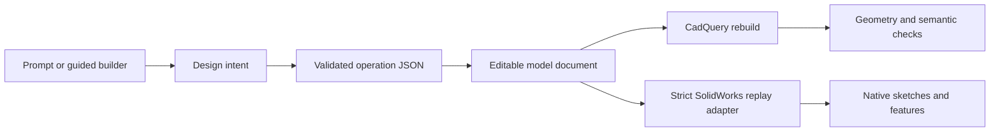

# Editable feature architecture

## Goal

Prompt2ParametricCAD should preserve more than the final STEP solid. A
successful model should also carry enough explicit design information to:

1. show a user named dimensions and feature controls;
2. change one or more values and rebuild the same ordered model;
3. preserve feature IDs, build order, support faces, and parent relationships;
4. replay an explicitly supported subset into a native CAD feature history.

The editable intermediate document remains the source of truth. The first
native SolidWorks `SLDPRT` adapter consumes that document; it does not replace
the CadQuery build or broaden support by silently flattening features.

## Top-down design

The operation JSON remains the execution contract. The editable model document
adds the information a UI or native-CAD adapter needs without changing the
working interpreter:

- a versioned format and explicit units;
- stable feature IDs and build order;
- semantic parents plus the previous feature in model history;
- original and canonical support references;
- normalized sketch entities;
- named driving parameters with exact paths back to operation JSON;
- reference snapshots for later face/edge selection;
- explicit limitations when a feature is not fully parametric yet.

Parameter edits are transactional. They are applied to a copy of the source
operations, validated against the existing schema, and rebuilt through
CadQuery. The previous document remains unchanged if validation or geometry
construction fails.

## Fit with the current system

The existing architecture already provides most of the hard prerequisites:

| Existing layer | Reused for editable features |
| --- | --- |
| Operation JSON | Source of exact dimensions and feature controls |
| Feature graph | IDs, build order, parents, children, and operation snapshots |
| Sketch model | Named points, lines, arcs, circles, and sketch dimensions |
| Reference registry | Canonical faces, edges, axes, local frames, and aliases |
| JSON Schema | Rejects invalid parameter values before accepting an edit |
| CadQuery interpreter | Proves that an edited feature sequence still builds |

This makes an additive intermediate layer safer than replacing the interpreter
or attempting to infer a feature tree from a STEP file.

## Native SolidWorks replay

The Windows adapter replays a validated plan through the installed SolidWorks
automation API:

1. create a new part from a configured or installed template and use
   SolidWorks API system units;
2. select standard datum planes by semantic XY/XZ/YZ identity when localized
   display names differ;
3. create each sketch on its recorded plane or resolved support reference;
4. recreate named sketch entities and driving dimensions;
5. create the corresponding native feature;
6. resolve later targets from semantic selection recipes after each rebuild;
7. capture persistent SolidWorks reference IDs for published faces and retain
   canonical geometric recipes for selected edge groups;
8. save to a staged `SLDPRT`, close and reopen it, require a successful rebuild,
   then verify dimensions, helper objects, sketch constraint state, feature
   health, geometry, and reference resolution before publishing the file.

The adapter never uses final B-rep edge numbers as its only source of
truth. It prefers feature ownership, support aliases, local frames, and
geometric selection criteria, because topology can change when an earlier
dimension changes.

### Current native slice

The adapter accepts models that can be replayed without inventing missing
constraints or selection rules:

- rectangle, circle, polygon, polyline, and line/arc sketch profiles;
- exact non-centered and repeated profile placements;
- native circular, linear, and sketch-driven mirrored patterns whose metadata
  is checked against the exact CadQuery instance positions;
- an `XY` base extrusion or revolve on the SolidWorks Front Plane;
- boss/cut extrusions on named planar top, bottom, front, back, left, or right
  feature faces;
- geometry-selected planar sides of arbitrary profiles, including sloped faces,
  with patterns expressed in each face's local coordinate frame;
- base, additive, and subtractive revolves with full or partial angles;
- real flat sweep-boundary faces from partial revolves, available to later
  sketches without a bounding-box-only approximation;
- native Hole Wizard countersinks with blind or through end conditions;
- native chamfers and fillets selected from feature ownership, semantic edge
  recipes, and saved local frames rather than transient edge numbers;
- local sketch frames that transform source coordinates onto native side faces;
- deterministic IDs for operations that omitted an explicit source ID;
- native sketch and feature names derived from stable feature IDs;
- named width, height, diameter, extrusion-distance, and blind-depth driving
  dimensions, plus named revolve angles and stable X/Y locating dimensions for
  non-centered rectangle and circle profiles;
- fixed sketch-local datum points, generalized coordinate constraints, and
  fully defined rectangle, circle, polygon, polyline, and line/arc sketches,
  including profiles on rotated side faces;
- semantic face publication backed by persistent SolidWorks reference IDs and
  canonical edge-group recipes for topology-aware detail features;
- verification that every expected sketch, feature, hidden pattern/support
  helper, parameter, and published reference exists before success is reported;
- close/reopen verification of the initial native build before its staged file
  is published;
- a machine-readable report listing the exact parameter IDs, helper names, and
  edited parameter IDs verified in the reopened native history;
- save/reopen mutation verification that confirms parameters remain editable
  and persistent references still resolve after a rebuild.

Native edits are preflighted as one transaction before the runner changes the
open document. After opening the closed source part, the runner first verifies
its CadQuery geometry oracle, complete named feature/helper/parameter history,
sketch health, and persistent references. Only then can parameter mutation
begin. Every native open must also resolve to the exact requested path as a
writable, fully resolved part; read-only, view-only, or mismatched documents
are closed and rejected. The preflight rejects non-finite or nonpositive dimensions,
fractional pattern counts, invalid angle ranges, unsafe coordinate sign
crossings, collapsed linear patterns, and countersinks whose seat diameter is
not larger than the through-hole diameter.

The runner temporarily disables SolidWorks' interactive dimension-entry prompt
and restores the user's prior setting after replay. It uses the configured part
template when available, asks the SolidWorks document-template API for the
local part template when needed, and only then falls back to the newest
installed standard part template. Ten real-application smoke models cover every supported profile as
well as boss/cut features, through and blind end conditions, patterns, full and
partial revolves, asymmetric freeform edge treatments, and multi-level feature
dependencies. A separate generated release matrix expands this to 292
profile/operation/face/pattern combinations and multi-feature repair chains.
A plan-only mutation preflight now runs across that entire 292-case matrix, so
binding, value-domain, and dependent-parameter failures are caught without
waiting for a SolidWorks session. The current matrix passes 292/292.
A focused installed-SolidWorks follow-up completed native creation and
save/reopen mutation verification for the six angled-planar cases added after
the original 286-case run, establishing a 292-case native baseline. The latest
polygon-diameter and Hole Wizard placement-control additions compile against
the installed API and pass focused deterministic gates; their native rerun is
required before the next public release claim.
A seven-case golden release matrix additionally starts from reviewed natural-
language/design-intent pairs and traverses lowering, STEP round-trip, editable
mutation, and SolidWorks replay planning.

Legacy repeated source positions remain exact contours so existing JSON keeps
working. Operations with canonical pattern metadata instead create one seed
feature followed by a native circular, linear, or sketch-driven mirror pattern.
The replay planner also emits native Hole Wizard countersinks and
topology-resolved chamfer and fillet operations. The suite compares SolidWorks
body count, volume, and bounding-box spans against the CadQuery result instead
of treating a saved file as proof of geometry parity.

## Predicted failure modes and mitigations

| Risk | Design response |
| --- | --- |
| An edit creates invalid or disconnected geometry | Validate and rebuild a copy before returning a new document. |
| Feature IDs change after an insertion | Require explicit IDs for persistent editing and flag generated fallback IDs. |
| Face or edge topology changes after a rebuild | Persist semantic face IDs; retain local-frame and geometric edge recipes; re-resolve after every feature. |
| A feature depends on more than one earlier feature | Represent parents as a list even though the current graph usually supplies one. |
| Build order and semantic ownership are confused | Store `build_predecessor_id` separately from `parent_feature_ids`. |
| A pattern rule disagrees with its generated positions | Retain exact positions as the geometry oracle and reject inconsistent seed/count metadata before SolidWorks opens. |
| Coordinate-driven sketches become underdefined or drift | Anchor a stable sketch datum, apply generalized relations and dimensions, and reject replay unless required sketches report fully defined. |
| A failed edit partially mutates the saved model | Deep-copy source operations and return a new document only after a successful rebuild. |
| Native CAD and CadQuery disagree about a selection | Keep CadQuery as the regression oracle and add adapter-specific replay tests before claiming support. |

## Near-term scope

The first milestone now provides:

- export a versioned editable document from any currently valid model;
- expose named sketch, placement, axis, and feature parameters;
- apply parameter changes and rebuild validated geometry;
- preserve IDs, relationships, and selection information across the rebuild;
- report which features still need constraints, locating dimensions, local
  frames, explicit IDs, or topology recipes before native replay;
- validate and serialize a deterministic SolidWorks replay plan without opening
  the external CAD application;
- produce a verified native `SLDPRT` for the supported subset.

The backend now exposes this layer through `/editable-model` and
`/edit-parameters`. The edit endpoint keeps the supplied model as the last
known-good revision and exports a new STEP file only after the parameter update,
schema, rebuild, operation-effect checks, and quality checks succeed.

Polyline vertices plus explicit-sketch start, end, and arc-through coordinates
now use stable named native dimensions when their values are nonzero. Zero
coordinates use native horizontal/vertical relations, and three-point arc
centers and radii remain derived to avoid over-constraining the sketch. The
audit distinguishes named edit bindings, relation-controlled zero coordinates,
derived reference geometry, side-limited coordinate bindings, and unsupported
parameters. Raw revolve endpoints are retained as one native construction line
and accompanied by canonical axis metadata; they are not mislabeled as missing
controls. A nonzero native coordinate can change magnitude on its current side
of the sketch origin;
crossing or landing on the origin requires regenerating the replay package so
SolidWorks can rebuild the appropriate relation and direction. Polygon side
count remains fixed topology rather than an automated mutation binding.

Native Hole Wizard position sketches now expose the same stable X/Y placement
controls as profile sketches. Only actual source hole points are selected for
the countersink feature, so the fixed internal dimension datum cannot create an
extra hole.

The next native increment should broaden mutation coverage without weakening the
current contract: CadQuery remains the geometry oracle, every declared native
parameter and helper must verify after reopening, required sketches must be
fully defined, and every published persistent reference must resolve.

The ten-case native edit gate now mutates both named dimensions and feature
properties. Its enforced coverage includes mirror-seed placement, circular
pattern count and total angle, both linear-pattern counts and spacings, length,
angle, and count units, and signed same-side coordinates. A fixture set that
only creates those controls but no longer edits them fails the release gate.
The compile-only package gate invokes the same C# mutation parser, range rules,
integer checks, signed-coordinate rules, and dependent linear-pattern checks
used immediately before native modification, without opening SolidWorks.
Mutation-document version 2 also embeds the expected geometry from the
transactional CadQuery rebuild. After SolidWorks mutates, saves, and reopens the
part, the runner compares body count, volume, area, bounds, and center of mass
before publishing the edited file.

Pattern-count edits are reported as topology-changing. The native feature count
remains editable, and every pre-existing persistent face reference must still
resolve after the rebuild. Newly added pattern instances cannot have IDs in the
older source plan; regenerate the package from the edited model before another
automated feature targets those new instances.

Run `prompt2cad-release-matrix` for the compact deterministic whole-pipeline
gate and `prompt2cad-solidworks-smoke` for the broader CadQuery build and
native-plan phase.
On a configured Windows workstation, add `--execute` to replay the same ten
fixtures into `SLDPRT` files and record per-fixture failures in one report.
