# Portfolio showcase

This concise set demonstrates the kinds of single connected mechanical parts
Prompt2ParametricCAD can currently build. Each prompt is paired with
project-authored design intent, lowered to the shared CAD-operation format, and
verified through schema, build, geometry, operation-effect, and
intent-alignment checks before it is included here.

These are reproducible deterministic examples, not a claim that every new
natural-language request will generate perfectly on the first attempt.

The cross-arm fixture, drainage tray, and support bracket extend the gallery
with original feature-hierarchy and spatial-relationship compositions inspired
by the kinds of CAD reasoning studied in CAD-Llama. Their prompts, dimensions,
and CAD records are project-authored rather than copied from the paper.

## Eleven verified parts

### 1. Patterned mounting plate

**Shows:** prismatic extrusion, rectangular feature patterns, and through-cut
holes.

> Create a 100 mm by 70 mm rectangular plate that is 8 mm thick with a 2 by 3
> grid of 5 mm through holes centered on the top face.

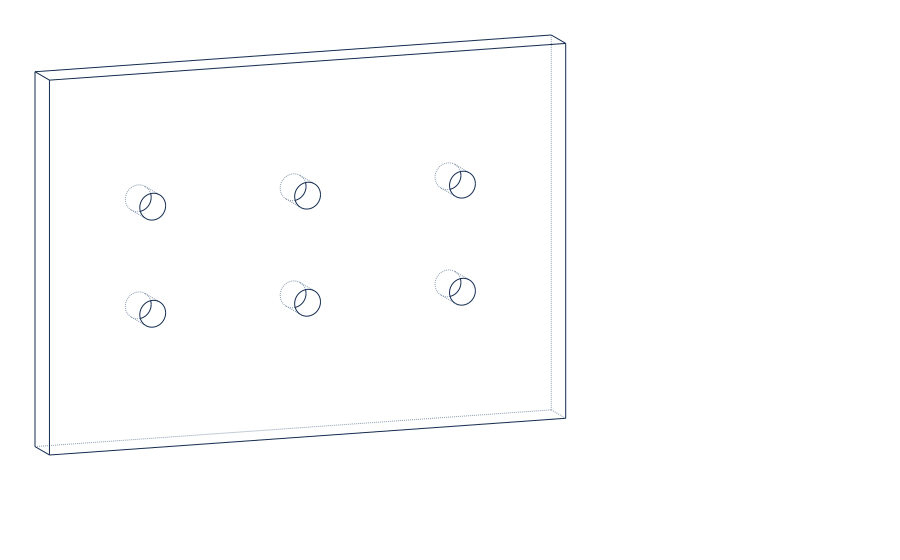

### 2. Sealed circular flange

**Shows:** circular profiles, bolt-circle placement, concentric openings, and
a revolved O-ring groove.

> Create a circular flange with eight bolt holes and a shallow circular O-ring
> groove around the center opening.

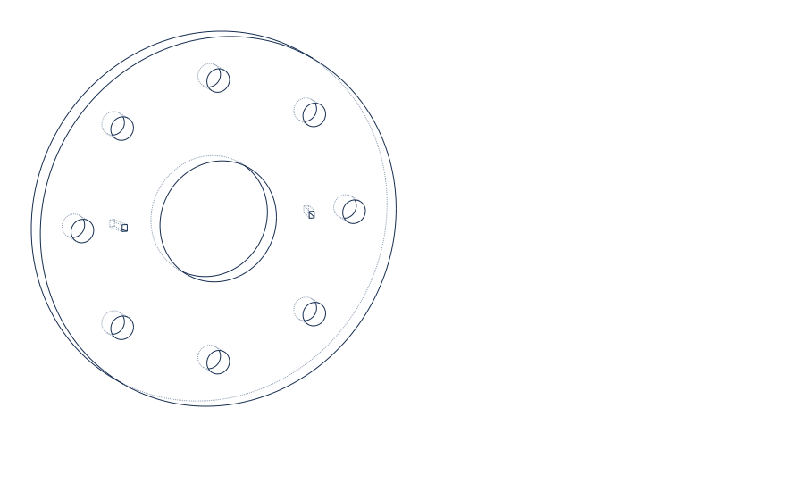

### 3. Hexagonal hub-and-bolt plate

**Shows:** a polygon base profile, a centered multi-level hub, a central bore,
and a circular bolt-hole pattern.

> Create a 110 mm hexagonal plate, 8 mm thick, with a centered 38 mm diameter
> circular hub 12 mm tall, a 16 mm through bore through the hub, and six 6 mm
> through holes on a 86 mm bolt circle.

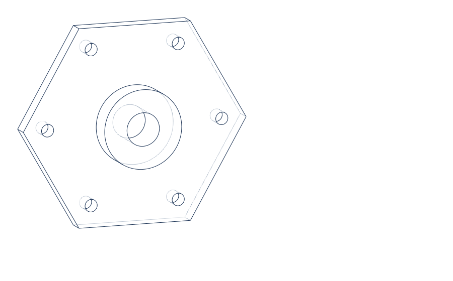

### 4. Turned shaft with collars and grooves

**Shows:** full revolves, revolved additions and cuts, and end chamfers.

> Create a cylindrical shaft with two narrow grooves near one end, a larger
> collar near the other end, and a chamfer on both shaft ends.

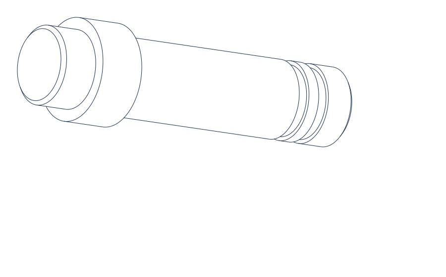

### 5. D-shaped mounting plate

**Shows:** a non-rectangular base outline, multiple explicit extrusions, and a
linear hole pattern.

> Create a D-shaped plate with a flat back edge and rounded front, two
> rectangular side tabs, and three circular through holes along the centerline.

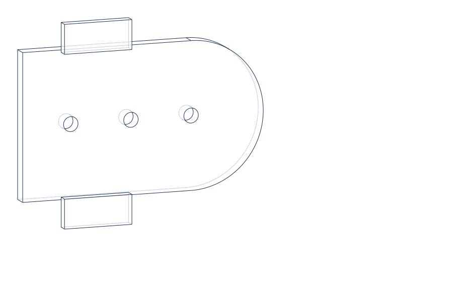

### 6. Counterbored bolt-circle flange

**Shows:** concentric feature dependencies, circular placement, through holes,
and shallow counterbores.

> Create a 110 mm diameter circular flange, 12 mm thick, with six equally
> spaced counterbored bolt holes on a 78 mm bolt circle. Each through hole is
> 6 mm diameter and each counterbore is 12 mm diameter by 4 mm deep.

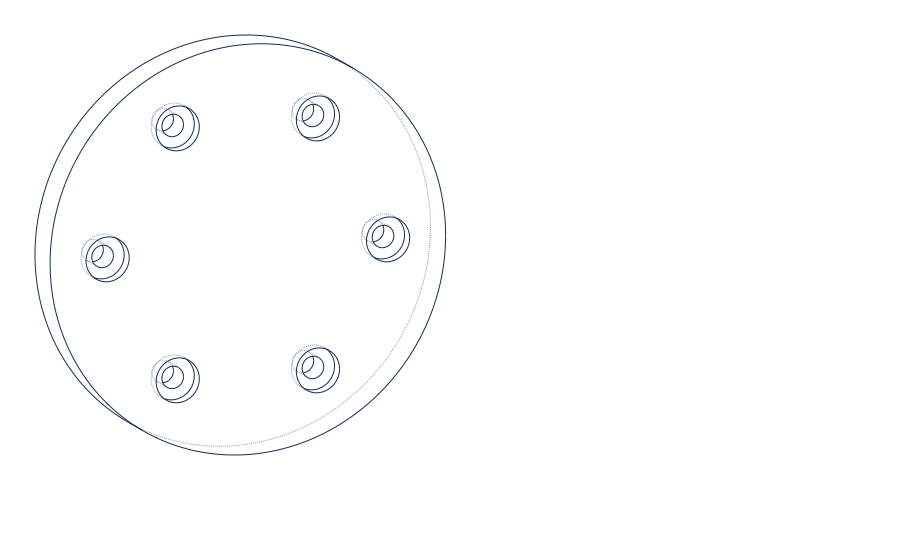

### 7. Nested boss with side cross-hole

**Shows:** parent-child feature order, features built on other features, and a
through cut made from a non-base face.

> Create a 90 mm by 60 mm by 10 mm rectangular base. Add a centered 42 mm by
> 28 mm rectangular boss 14 mm tall, add a centered 22 mm diameter circular
> boss 10 mm tall on top of it, then cut an 8 mm horizontal through hole through
> the side of the rectangular boss.

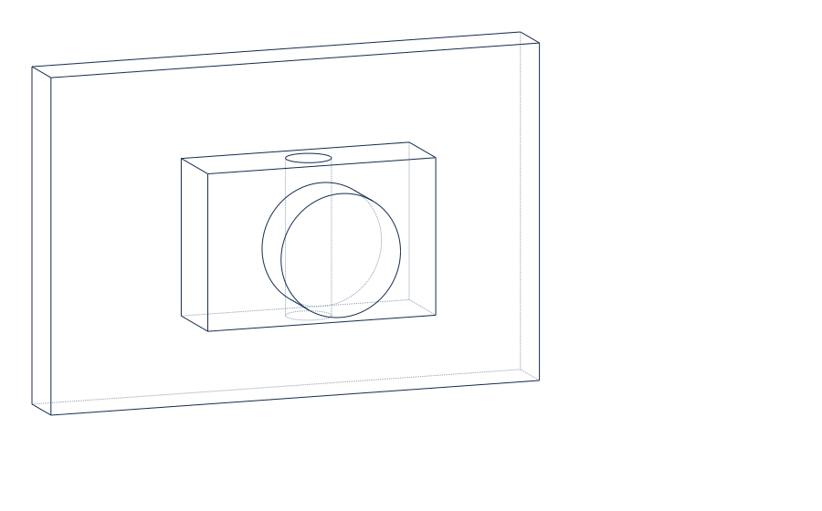

### 8. Two-wall U-bracket

**Shows:** symmetric multi-feature construction, face-aware wall features, and
holes that target the side walls rather than the base.

> Create a U bracket from a 90 mm by 55 mm by 8 mm base plate with two 8 mm
> thick vertical side walls, each 45 mm tall. Put one 8 mm through hole through
> the center of each wall.

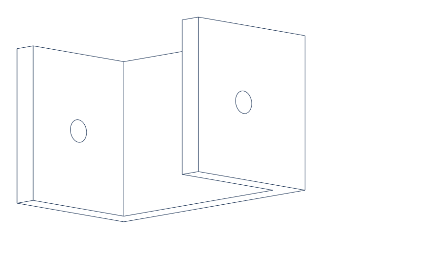

### 9. Cross-arm fixture plate with hex drive

**Shows:** Boolean-created cross arms, a nested cylindrical hub, a polygonal
through bore, and distributed arm holes.

> Create a 120 mm by 120 mm cross-arm fixture plate, 8 mm thick, with four
> square corner cutouts. Add a centered 42 mm diameter circular hub 18 mm tall,
> a 18 mm hexagonal through bore through the hub, and four 7 mm through holes
> centered in the arms.

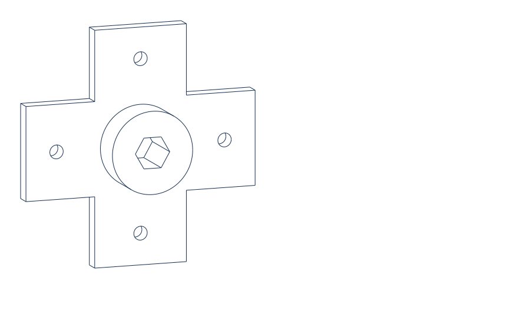

### 10. Open-top drainage tray

**Shows:** an ordered floor, drain, and multi-wall build that forms a single
open-top enclosure.

> Create a 120 mm by 80 mm open-top drainage tray with a 5 mm thick floor and
> four 25 mm tall walls. Add an 18 mm circular drain through the floor at the
> center.

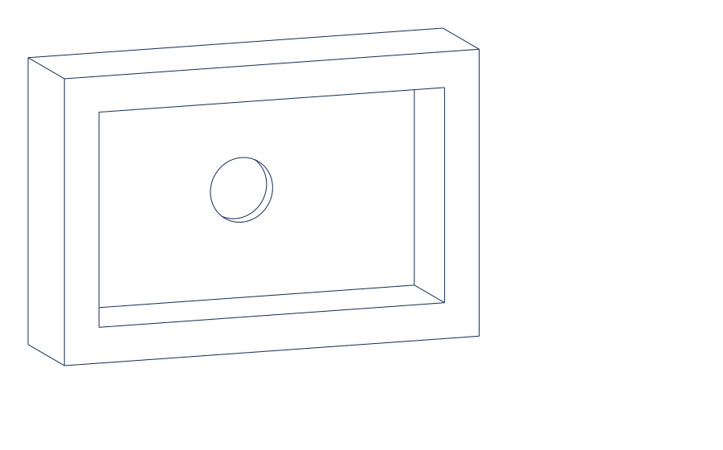

### 11. Ribbed support bracket

**Shows:** layered bracket construction, a wall-local rounded slot, reinforcing
support blocks, and base mounting holes.

> Create a 120 mm by 70 mm by 8 mm mounting plate with two 8 mm mounting holes
> near the front corners. Add a 100 mm wide vertical support wall along the
> back edge, two reinforcing support blocks, and a centered 40 mm by 12 mm
> rounded slot through the wall.

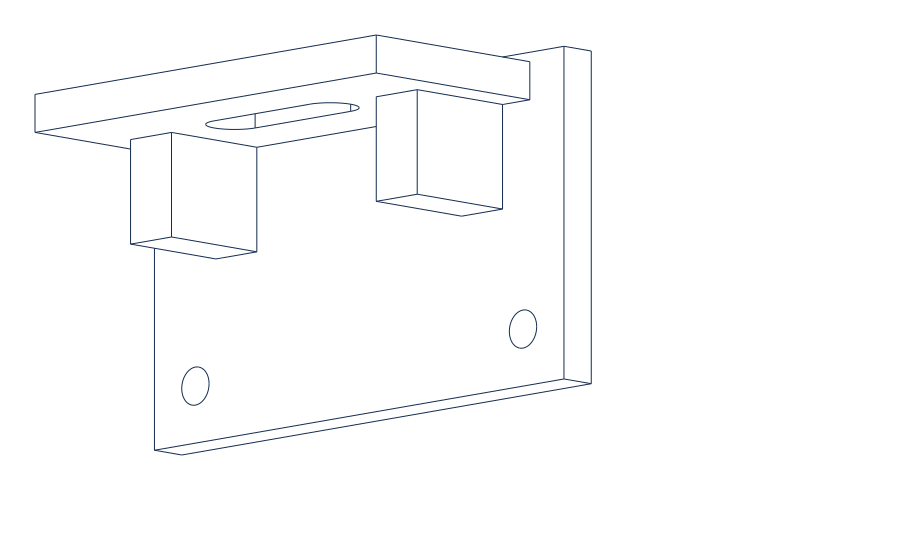

## Reproduce the STEP files

Run the verified showcase exporter from the repository root:

```powershell
$env:PYTHONPATH = "src"
python -m prompt2cad.showcase
```

It writes one STEP file per part under `generated/showcase/`. The output folder
is ignored by Git so the demo always shows freshly built geometry rather than
stale committed artifacts. To run the same checks without exporting files:

```powershell
python -m prompt2cad.showcase --validate-only
```

To regenerate the tracked SVG portfolio drawings along with fresh STEP files:

```powershell
python -m prompt2cad.showcase --svg-dir docs\assets\showcase
```

The underlying prompt-to-intent records live in
[`training/intent_examples/`](../training/intent_examples/), and the tracked
showcase manifest is [`docs/showcase.json`](showcase.json).
